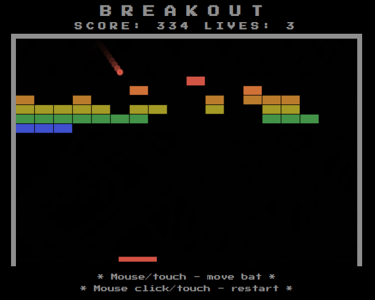

# minigame-breakout

_Based on Atari 2600 Breakout_

Link: https://jakobmollas.github.io/minigame-breakout/

Implemented using Html5 Canvas and pure Javascript.

* Use mouse/touch to move bat
* Mouse click/touch to launch ball/restart etc.
* 2 levels, speedups, shrinking bat etc. as per original
* Max score 2*432 points

Using a library like **P5.js** would simplify a lot of things but I wanted to see how hard it would be to work with vanilla js + canvas only, which was pretty straight-forward, at least for this game.

The hardest part for me was to implement a reasonable ball -> brick collision detection. It works pretty good now but does not support insane speeds or more correctly too large deltas in ball movement, for example if the ball would move more than one brick height/width in one frame.

Also, finding good ways to structure Javascript proved challenging.

